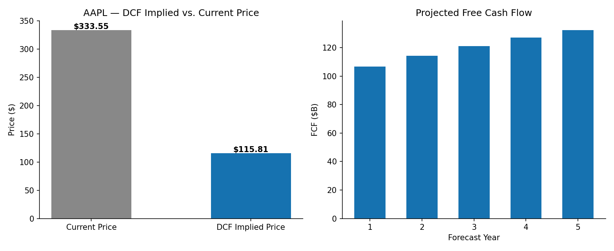

# Discounted Cash Flow Valuation — Apple Inc. (NASDAQ: AAPL)

**Prepared by:** Peter Velez Vereš
**Date:** July 19, 2026
**Sector:** Technology — Consumer Electronics
**Methodology:** 5-Year Discounted Cash Flow (DCF), CAPM-derived WACC, Gordon Growth Terminal Value

---

## Executive Summary

This report values Apple Inc. using a standard unlevered free cash flow (FCF) discounted cash flow model. Free cash flow is projected over a five-year explicit forecast period under a declining growth-rate schedule, discounted at the company's Weighted Average Cost of Capital (WACC), and combined with a terminal value calculated via the Gordon Growth model. The resulting equity value is divided by shares outstanding to produce an implied per-share valuation, benchmarked against the prevailing market price.

Under base-case assumptions, the model implies a valuation of **$115.81 per share** against a market price of **$333.55** (dated 2026-07-19), representing an implied downside of **65.3%**. This gap is interpreted in the *Discussion* section below — it is a known characteristic of conservative multi-stage DCF applied to mega-cap growth equities, not an assertion that the market is mispricing the security. A sensitivity analysis across WACC and terminal growth assumptions is provided to contextualize the model's precision.

This is an independent academic exercise using public data and does not constitute investment research or a recommendation to buy, hold, or sell any security.

---

## 1. Valuation Methodology

**Approach:** Unlevered Free Cash Flow to Firm (FCFF), discounted at WACC, five-year explicit forecast plus terminal value.

| Step | Description |
|---|---|
| 1 | Establish base-year FCF (Operating Cash Flow − CapEx) |
| 2 | Project FCF forward five years under a declining growth schedule |
| 3 | Discount each year's FCF to present value at WACC |
| 4 | Calculate terminal value via Gordon Growth, discount to present value |
| 5 | Sum discounted FCF and terminal value to derive Enterprise Value |
| 6 | Bridge to Equity Value (– total debt, + cash and equivalents) |
| 7 | Divide by diluted shares outstanding for implied share price |

## 2. Key Assumptions

| Assumption | Value | Basis |
|---|---|---|
| Base-year FCF | $98.8B | FY2025 10-K: Operating Cash Flow ($111.5B) − CapEx ($12.7B) |
| FCF growth, Years 1–5 | 8.0% → 4.0% (declining) | Analyst estimate; moderates toward terminal growth |
| Terminal growth rate | 2.5% | Approximate long-run nominal GDP growth |
| Risk-free rate | 4.3% | 10-Year US Treasury yield |
| Equity risk premium | 5.0% | Long-run US equity market estimate |
| Beta | 1.10 | Reported beta, StockAnalysis.com |
| Pre-tax cost of debt | 4.5% | Approximate yield on outstanding Apple corporate bonds |
| Effective tax rate | 15.0% | Approximate historical effective rate |

## 3. WACC Derivation

| Component | Value |
|---|---|
| Cost of Equity (CAPM) | 9.80% |
| Cost of Debt (after-tax) | 3.82% |
| Weight — Equity | 98.3% |
| Weight — Debt | 1.7% |
| **WACC** | **9.70%** |

## 4. Valuation Output

| Metric | Value |
|---|---|
| Enterprise Value | $1,639.4B |
| (–) Total Debt | $84.7B |
| (+) Cash & Equivalents | $146.6B |
| **Equity Value** | **$1,701.3B** |
| Shares Outstanding | 14.69B |
| **Implied Share Price** | **$115.81** |
| Current Market Price | $333.55 |
| **Implied Upside / (Downside)** | **(65.3%)** |



## 5. Sensitivity Analysis

Implied share price ($) across a range of WACC and terminal growth assumptions:

| WACC \ g | 1.5% | 2.0% | 2.5% | 3.0% | 3.5% |
|---|---|---|---|---|---|
| 7.70% | 138.57 | 148.03 | 159.32 | 173.01 | 189.96 |
| 8.70% | 119.61 | 126.29 | 134.05 | 143.17 | 154.05 |
| **9.70%** | 105.28 | 110.21 | **115.81** | 122.25 | 129.73 |
| 10.70% | 94.08 | 97.83 | 102.03 | 106.77 | 112.18 |
| 11.70% | 85.08 | 88.01 | 91.24 | 94.86 | 98.91 |

## 6. Discussion

The model's implied valuation sits materially below the current market price. This divergence is a well-documented characteristic of applying a conservative, short-horizon multi-stage DCF to a mega-cap company with a large embedded growth and capital-return premium: with a market capitalization of approximately $4.9T against ~$99B in base-year free cash flow, the market price implies either (a) sustained FCF growth materially above the 4–8% range modeled here, (b) an effective discount rate below the CAPM-derived WACC used, or (c) value attributable to capital return policy (share buybacks) and optionality (new product categories, services growth) that a pure FCFF projection does not capture.

This divergence should be read as a limitation of the modeling approach applied, not as a market-timing signal.

## 7. Limitations

- Single blended FCF growth path; does not independently model revenue growth, margin trajectory, or capital intensity
- WACC and terminal growth are point estimates; the sensitivity table partially, but not fully, addresses this
- Does not incorporate share repurchase activity, which is a material component of capital return for this issuer
- Tax rate and cost of debt are approximated, not pulled from primary filings in this version

## 8. Next Steps

Extend with a comparable company analysis (trading multiples: EV/EBITDA, P/E, EV/Revenue) as an independent cross-check against this DCF output.

---

## Technical Appendix

**Tech Stack:** `Python 3.x` · `yfinance` · `matplotlib`

**Data Source:** Live data via [yfinance](https://pypi.org/project/yfinance/) (Yahoo Finance) at runtime, with a sourced fallback (dated 2026-07-19; SEC 10-K FY2025, StockAnalysis.com, Morningstar — see `src/dcf_model.py` for full citations) used when the API is unreachable.

**Repository Structure**

```
quantitative-asset-pricing/
├── README.md                  (repo-level index of all analyses)
├── LICENSE
├── .gitignore
└── dcf-valuation/
    ├── README.md               (this file)
    ├── requirements.txt
    ├── src/
    │   └── dcf_model.py
    ├── notebooks/
    ├── data/
    └── outputs/
        └── dcf_valuation_bridge.png
```

**How to Run**

```bash
git clone https://github.com/velezverespeter/quantitative-asset-pricing.git
cd quantitative-asset-pricing/dcf-valuation
pip install -r requirements.txt

python src/dcf_model.py --ticker AAPL          # live data
python src/dcf_model.py --ticker AAPL --fallback   # sourced reference data, no network call
```

**License:** MIT (see LICENSE)

---

<sub>This document is an independent academic exercise prepared using publicly available data and open-source tools. It does not constitute investment research, financial advice, or a recommendation to buy, hold, or sell any security, and should not be relied upon as such. All figures are sourced and dated as indicated; no warranty is made as to their accuracy or completeness. Apple Inc. and the AAPL ticker are the property of their respective owner and are referenced here for identification purposes only.</sub>
